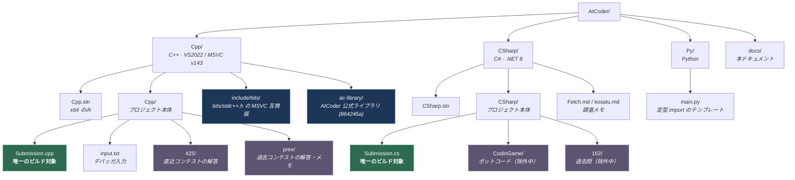
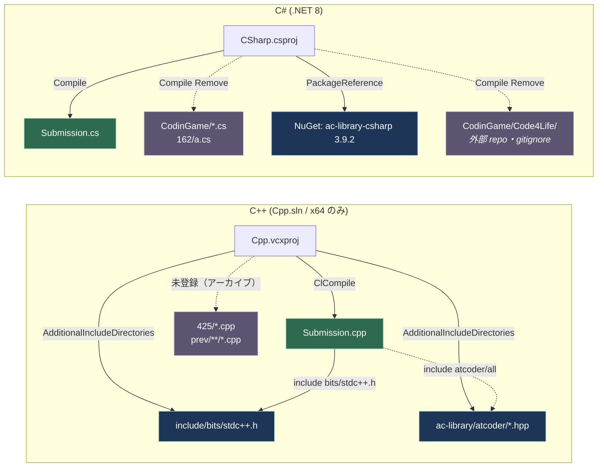
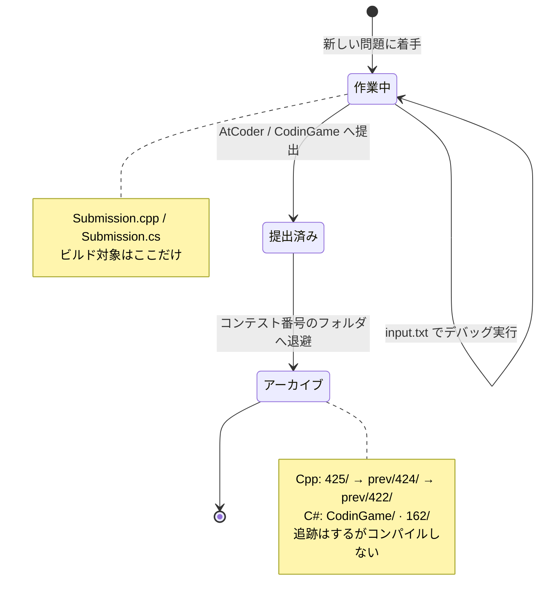

# リポジトリ構成

AtCoder / CodinGame の提出コード置き場の構造。セットアップ手順やビルド上の注意は [README.md](../README.md) を参照。

## 全体像（パッケージ図）

緑がビルド対象、青が依存ライブラリ、紫がアーカイブ（追跡はしているがコンパイルされない）。

## ビルド依存（コンポーネント図）

C++ / C# のどちらも **「今書いている 1 ファイルだけをコンパイルし、残りはアーカイブとして置いておく」** という同じ構造になっている。
提出コードは global namespace に `Main` / `main` や `GameState` を定義する単体プログラムなので、同時にコンパイルすると必ず重複定義で衝突するため。

実線が有効な依存、破線が意図的に切ってある依存。

### 図から読み取れる制約

| 制約 | 理由 |
|---|---|
| ビルド対象は `Submission.cpp` / `Submission.cs` の 1 つだけ | 提出コードは単体プログラムなので同時コンパイルすると重複定義で衝突する。切り替える時は `Cpp.vcxproj` の `ClCompile` / `CSharp.csproj` の `Compile Remove` を入れ替える |
| C++ の構成は x64 のみ | ac-library が 64bit 専用の組み込み関数 `_umul128` を使っており x86 ではビルドできない。AtCoder のジャッジも 64bit |
| `bits/stdc++.h` と ac-library は repo 同梱 | MSVC のインストールフォルダにコピーする方式だと VS 更新でパスのバージョン番号が変わって消えるため |
| `Code4Life/` は追跡しない | CodinGame 公式 referee の別リポジトリ。手元にあるかどうかでビルド結果が変わらないよう `Compile Remove` もしている |

## 提出コードのライフサイクル

